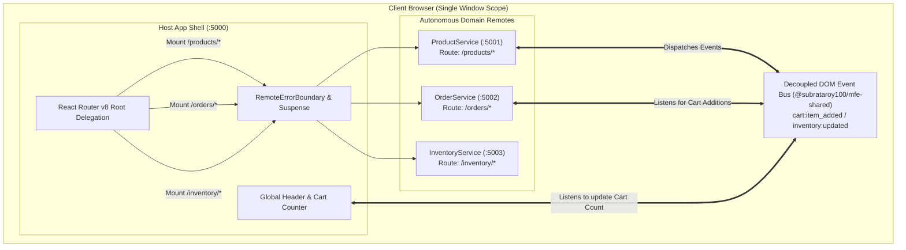

# Micro-Frontends (MFE) Getting Started Notebook

<div align="center">

### Interactive Architectural Guide & Hands-On E-Commerce Walkthrough
**Target Stack:** Vite 8 + Module Federation + React 19 + React Router v8 + Tailwind CSS v4 + pnpm Workspaces  
**Author:** Subrata Roy

</div>

---

## Table of Contents
1. [Introduction: Why Micro-Frontends?](#1-introduction-why-micro-frontends)
2. [The Architecture Map: Enterprise E-Commerce](#2-the-architecture-map-enterprise-e-commerce)
3. [Hands-On Step 1: Scaffolding the Remotes](#3-hands-on-step-1-scaffolding-the-remotes)
4. [Hands-On Step 2: Routing & Dynamic Federation](#4-hands-on-step-2-routing--dynamic-federation)
5. [Hands-On Step 3: Cross-Boundary Communication (Event Bus)](#5-hands-on-step-3-cross-boundary-communication-event-bus)
6. [Fault Tolerance & Error Isolation](#6-fault-tolerance--error-isolation)
7. [Developer Superpower: Targeted Local DX](#7-developer-superpower-targeted-local-dx)
8. [Production Deployment & Cache Strategy](#8-production-deployment--cache-strategy)

---

## 1. Introduction: Why Micro-Frontends?

As web applications scale across multiple engineering squads, traditional monolithic frontend architectures begin to degrade:
- **Deployment Bottlenecks**: A small bug in an analytics widget blocks an entire catalog or checkout release.
- **Dependency Drift & Version Lock**: Teams cannot update dependencies independently without risking regressions across unrelated features.
- **Monolithic CI/CD Friction**: Long build queues, slow test runs, and high developer friction.

### The Host Shell + Remotes Model

Our starter framework decomposes the frontend into:
1. **The Host Shell (`packages/host`)**: The primary shell container responsible for authentication state, top-level layout navigation, route delegation, and fault-tolerant `<RemoteErrorBoundary>` wrappers.
2. **Autonomous Remotes (`packages/*`)**: Independent micro-frontend applications that can be developed, tested, built, and deployed on their own lifecycle cadence without rebuilding the Host Shell.

---

## 2. The Architecture Map: Enterprise E-Commerce

To demonstrate real-world utility, this walkthrough constructs a multi-remote **E-Commerce Platform** comprised of three autonomous micro-frontends coordinated by a unified Host Shell:



### Domain Responsibilities

| Service | Port | Mount Path | Responsibilities |
| :--- | :---: | :---: | :--- |
| **Host Shell** | `5000` | `/` | Top-level header, cart counter widget, global navigation, and error isolation fallbacks. |
| **`ProductService`** | `5001` | `/products/*` | Product catalog grid, search/filtering, product detail views, and "Add to Cart" triggers. |
| **`OrderService`** | `5002` | `/orders/*` | Shopping cart drawer, checkout funnel, payment processing, and order history. |
| **`InventoryService`** | `5003` | `/inventory/*` | Stock availability indicators, warehouse inventory trackers, and low-stock alerts. |

---

## 3. Hands-On Step 1: Scaffolding the Remotes

In this framework, micro-frontends are registered via a **Single Source of Truth** manifest: `remotes.manifest.json`.

### 1.1 Register Remotes in `remotes.manifest.json`

Add the three domain services to `remotes.manifest.json`:

```json
{
  "productService": {
    "port": 5001,
    "path": "/products",
    "entry": "/remoteEntry.js",
    "envVar": "VITE_PRODUCT_SERVICE_URL"
  },
  "orderService": {
    "port": 5002,
    "path": "/orders",
    "entry": "/remoteEntry.js",
    "envVar": "VITE_ORDER_SERVICE_URL"
  },
  "inventoryService": {
    "port": 5003,
    "path": "/inventory",
    "entry": "/remoteEntry.js",
    "envVar": "VITE_INVENTORY_SERVICE_URL"
  }
}
```

> [!NOTE]
> All build scripts, preview servers, and host federation configs read this manifest dynamically. Adding a remote here wires it into the monorepo orchestration automatically.

### 1.2 Configure Remote Federation Provider (`packages/productService/vite.config.js`)

Each remote uses the high-level preset from `@subrataroy100/mfe-shared/vite` to expose its root sub-app and components:

```javascript
import { defineRemoteConfig } from "@subrataroy100/mfe-shared/vite";

export default defineRemoteConfig({
  name: "productService",
  framework: "react",          // Configures React 19 singletons automatically
  // Port is auto-inferred from remotes.manifest.json (port 5001)
  exposes: {
    // Expose full sub-application
    "./App": "./src/App.jsx",
    // Expose reusable standalone widget
    "./ProductCard": "./src/components/ProductCard.jsx",
  },
  // Merge extra singleton deps on top of the React baseline
  shared: {
    "react-query": { singleton: true },
  },
});
```

> [!TIP]
> `defineRemoteConfig` automatically configures React 19 singletons (`react`, `react-dom`, `react-router`), Tailwind CSS v4, the `federation-css-fix` plugin, and strict preview ports with CORS headers. The `shared` field is merged on top of the framework baseline — you only need to list **additional** dependencies.

### 1.3 Expose Your Root Component with `createReactMount`

To make your remote consumable by **non-React** hosts (Vue, Svelte, Vanilla JS) or by `UniversalRemoteMount` in Shadow DOM mode, wrap your root component with `createReactMount` before exporting:

```jsx
// packages/productService/src/App.jsx
import { createReactMount } from "@subrataroy100/mfe-shared/adapters";
import ProductApp from "./ProductApp.jsx";

// The returned value is both a React functional component (usable in JSX)
// AND a universal mount object { mount(container, props), unmount() }
export default createReactMount(ProductApp);
```

> [!NOTE]
> `createReactMount` returns a **dual-mode** function: it behaves like a normal React component when used in JSX, and also provides a `.mount(container, props)` / `.unmount()` lifecycle for framework-agnostic hosts. This is the standard export contract for all remotes in this monorepo.


---

## 4. Hands-On Step 2: Routing & Dynamic Federation

### 2.1 Dynamic Promise-Based Federation in Host (`packages/host/vite.config.js`)

Instead of hardcoding remote URLs, the Host dynamically maps manifest entries into promise-based resolvers. This allows production environments to inject `window.__MFE_RUNTIME_CONFIG__` at runtime without rebuilding the shell:

```javascript
import { readFileSync } from "node:fs";
import { fileURLToPath } from "node:url";
import federation from "@originjs/vite-plugin-federation";
import react from "@vitejs/plugin-react";
import { defineConfig } from "vite";
import tailwindcss from "@tailwindcss/vite";

const manifestPath = fileURLToPath(new URL("../../remotes.manifest.json", import.meta.url));
const remotesManifest = JSON.parse(readFileSync(manifestPath, "utf-8"));

// Dynamically construct remote definitions
const remotes = Object.fromEntries(
  Object.entries(remotesManifest).map(([name, cfg]) => {
    const fallbackUrl = process.env[cfg.envVar] || `http://localhost:${cfg.port}${cfg.entry}`;
    return [
      name,
      {
        external: `Promise.resolve((typeof window !== 'undefined' && window.__MFE_RUNTIME_CONFIG__ && window.__MFE_RUNTIME_CONFIG__['${name}']) || '${fallbackUrl}')`,
        externalType: "promise",
      },
    ];
  })
);

export default defineConfig(({ mode }) => ({
  plugins: [
    react(),
    tailwindcss(),
    federation({
      name: "host",
      remotes,
      shared: {
        react: { singleton: true, requiredVersion: "^19.0.0" },
        "react-dom": { singleton: true, requiredVersion: "^19.0.0" },
        "react-router": { singleton: true, requiredVersion: "^8.0.0" },
      },
    }),
  ],
  server: { port: 5000, strictPort: true },
}));
```

### 2.2 Host Shell Routing (`packages/host/src/App.jsx`)

The Host Router delegates nested path control to each remote using wildcard paths (`/*`). The recommended approach uses `UniversalRemoteMount` from `@subrataroy100/mfe-shared/adapters`, which handles loading state, error recovery, Shadow DOM isolation, and cross-framework remotes all in one component:

```jsx
import React, { lazy, Suspense } from "react";
import { Routes, Route } from "react-router";
import { UniversalRemoteMount } from "@subrataroy100/mfe-shared/adapters";
import LoadingFallback from "./components/LoadingFallback";

const LandingPage = lazy(() => import("./pages/LandingPage"));

export default function App() {
  return (
    <Routes>
      <Route
        path="/"
        element={
          <Suspense fallback={<LoadingFallback message="Loading Host Shell..." />}>
            <LandingPage />
          </Suspense>
        }
      />

      {/* Wildcard "/*" lets ProductService manage /products/ and /products/:id */}
      <Route
        path="/products/*"
        element={
          <UniversalRemoteMount
            module={() => import("productService/App")}
            remoteName="Product Catalog"
            fallback={<LoadingFallback message="Streaming Product Service..." />}
            errorFallback={(err, retry) => (
              <div className="p-4 text-red-400">
                Failed: {err.message}
                <button onClick={retry}>Retry</button>
              </div>
            )}
          />
        }
      />

      <Route
        path="/orders/*"
        element={
          <UniversalRemoteMount
            module={() => import("orderService/App")}
            remoteName="Order & Checkout Service"
            fallback={<LoadingFallback message="Loading Orders..." />}
          />
        }
      />

      <Route
        path="/inventory/*"
        element={
          <UniversalRemoteMount
            module={() => import("inventoryService/App")}
            remoteName="Inventory Service"
            fallback={<LoadingFallback message="Loading Inventory..." />}
          />
        }
      />
    </Routes>
  );
}
```

> [!TIP]
> `UniversalRemoteMount` accepts the `module` prop as a **function returning a dynamic import** — `module={() => import('productService/App')}`. This keeps the import lazy and retriable. You can also pass a `retryKey` prop (increment it externally) for parent-controlled reloads.

### 2.3 `UniversalRemoteMount` — Full API Reference

| Prop | Type | Default | Description |
| :--- | :--- | :--- | :--- |
| `module` | `() => Promise<any>` | — | **Required.** Function returning the dynamic `import()` of the remote. |
| `props` | `object` | `{}` | Props forwarded to the mounted remote component. |
| `fallback` | `ReactNode` | built-in spinner | Displayed while the remote is loading. |
| `errorFallback` | `(err, retry) => ReactNode` | built-in error card | Custom error UI. Receives the `Error` and a `retry` callback. |
| `shadowDom` | `boolean \| ShadowRootInit` | `false` | Wraps the remote in an isolated Shadow DOM to prevent CSS bleed. |
| `remoteName` | `string` | `"Remote Micro-Frontend"` | Display name used in logs and default error messages. |
| `retryKey` | `number \| string` | `0` | Increment to trigger a full module reload from the parent. |
| `remoteKey` | `string` | `remoteName` | Stable key that, when changed, destroys and remounts the remote. |
| `onError` | `(err: Error) => void` | — | Callback fired when loading or mounting fails. |

**Shadow DOM example** (CSS-isolated Vue or Svelte remote mounted in a React host):

```jsx
<UniversalRemoteMount
  module={() => import("inventoryService/App")}
  props={{ warehouseId: "WH-42" }}
  shadowDom={{ mode: "open" }}
  fallback={<div>Loading Inventory...</div>}
  errorFallback={(err, retry) => (
    <div>Error: {err.message} <button onClick={retry}>Retry</button></div>
  )}
/>
```

### 2.4 Autonomous Relative Routing Contract (`packages/productService/src/App.jsx`)

To ensure micro-apps can run both **standalone** (`http://localhost:5001/`) and **embedded** (`http://localhost:5000/products/`), remotes must use relative paths:

```jsx
import React from "react";
import { Routes, Route, Link } from "react-router";
import ProductCatalogPage from "./pages/ProductCatalogPage";
import ProductDetailPage from "./pages/ProductDetailPage";

export default function App() {
  return (
    <div className="mfe-remote-root mfe-product-service">
      <Routes>
        <Route path="/" element={<ProductCatalogPage />} />
        <Route path=":id" element={<ProductDetailPage />} />
      </Routes>
    </div>
  );
}
```

- In `ProductCatalogPage.jsx`: `<Link to="item-123">` navigates relatively to `/products/item-123` when embedded, and `/item-123` when standalone.
- In `ProductDetailPage.jsx`: `<Link to=".." relative="path">` navigates back to the root catalog without hardcoding parent URLs.

---

## 5. Hands-On Step 3: Cross-Boundary Communication (Event Bus)

Micro-frontends should never share global state stores (Redux, Zustand) across independent deployments. Doing so introduces tight coupling and memory leaks. Instead, communicate using standard browser `CustomEvents` with our lightweight, lifecycle-safe `@subrataroy100/mfe-shared/events` library.

### 5.0 Built-In Event Name Constants (`MFE_EVENTS`)

The shared library ships a set of pre-defined event name constants to keep event naming consistent across all remotes:

```javascript
import { MFE_EVENTS } from "@subrataroy100/mfe-shared/events";

// MFE_EVENTS.CART_UPDATE   = 'mfe:cart_update'
// MFE_EVENTS.ORDER_PLACED  = 'mfe:order_placed'
// MFE_EVENTS.PING          = 'mfe:ping'
// MFE_EVENTS.PONG          = 'mfe:pong'
// MFE_EVENTS.NOTIFICATION  = 'mfe:notification'
// MFE_EVENTS.NAVIGATION    = 'mfe:navigation'
```

Use these constants in both senders and listeners to avoid typo-driven bugs across team boundaries.

### 5.1 Scoped Event Bus: `createMfeEventBus`

Both emitters and listeners should use `createMfeEventBus` — a **scoped bus factory** that stamps each event with a `sender` identifier and an optional namespace prefix. This prevents global naming collisions when 10+ remotes run concurrently:

```javascript
import { createMfeEventBus } from "@subrataroy100/mfe-shared/events";

// Instantiate once per remote module — not inside components
const bus = createMfeEventBus({
  sender: "product-service",    // stamped on every outgoing event
  namespace: "team-commerce",   // prefixed to event names: "team-commerce:cart:item_added"
});
```

The bus instance exposes three methods:

| Method | Description |
| :--- | :--- |
| `bus.send(eventName, payload)` | Dispatches a `CustomEvent` on `window` with sender + namespace stamped. |
| `bus.listen(eventName, handler)` | Vanilla JS listener; returns an **unsubscribe** cleanup function. Suitable for any framework. |
| `bus.useListener(eventName, handler)` | **React hook** version of `listen`. Auto-cleans up on component unmount. |

### 5.2 Emitter: Dispatching Cart Events (`ProductCard.jsx`)

When a user clicks "Add to Cart" inside the `productService` remote:

```jsx
import React from "react";
import { createMfeEventBus } from "@subrataroy100/mfe-shared/events";

// Create a module-scoped bus — no re-creation per render
const bus = createMfeEventBus({ sender: "product-service", namespace: "team-commerce" });

export default function ProductCard({ product }) {
  const handleAddToCart = () => {
    bus.send("cart:item_added", {
      id: product.id,
      name: product.name,
      price: product.price,
    });
  };

  return (
    <div className="p-4 rounded-xl border border-slate-800 bg-slate-950 flex items-center justify-between">
      <div>
        <h4 className="font-bold text-white">{product.name}</h4>
        <span className="text-indigo-400 font-semibold">${product.price}</span>
      </div>
      <button
        onClick={handleAddToCart}
        className="px-3.5 py-2 rounded-lg bg-indigo-600 hover:bg-indigo-500 text-white font-semibold text-xs transition"
      >
        Add to Cart +
      </button>
    </div>
  );
}
```

### 5.3 Listener: Auto-Cleanup React Hook (`CartHeaderWidget.jsx`)

The Host Shell and `orderService` listen for cart updates using `bus.useListener`, which automatically subscribes on mount and unsubscribes on unmount — no manual `useEffect` required:

```jsx
import React, { useState } from "react";
import { createMfeEventBus } from "@subrataroy100/mfe-shared/events";

const bus = createMfeEventBus({ sender: "host-shell", namespace: "team-commerce" });

export function CartHeaderWidget() {
  const [cartItems, setCartItems] = useState([]);

  // Subscribes on mount, automatically removed on unmount
  bus.useListener("cart:item_added", (detail) => {
    console.log(`[Cart] Received item from ${detail.sender}:`, detail.item ?? detail);
    setCartItems((prev) => [...prev, detail]);
  });

  return (
    <div className="flex items-center gap-2 px-3 py-1.5 rounded-xl bg-slate-900 border border-slate-700 text-xs text-white">
      <span>🛒 Cart Counter:</span>
      <span className="px-2 py-0.5 rounded-full bg-indigo-600 font-bold font-mono">
        {cartItems.length}
      </span>
    </div>
  );
}
```

### 5.4 Non-React Listeners (Vue / Svelte / Vanilla JS)

For non-React environments, import from the `/events/core` subpath and use `bus.listen()` directly — it returns a plain unsubscribe function you manage yourself:

```javascript
// Works in Vue, Svelte, Solid, or any Vanilla JS context
import { createMfeEventBus } from "@subrataroy100/mfe-shared/events/core";

const bus = createMfeEventBus({ sender: "order-service", namespace: "team-commerce" });

// Returns cleanup function — call in component teardown
const unsubscribe = bus.listen("cart:item_added", (detail) => {
  console.log("[OrderService] Cart updated:", detail);
});

// In Vue onUnmounted / Svelte onDestroy:
// unsubscribe();
```

> [!NOTE]
> The `/events/core` subpath exports the pure-JS core (no React imports), making it safe for non-React remotes to import without pulling in React hooks as a side-effect.


---

## 6. Fault Tolerance & Error Isolation

In a micro-frontend architecture, network partitions or unhandled runtime exceptions inside a remote must **never take down the Host application shell**.

### Built-In Error Isolation via `UniversalRemoteMount`

`UniversalRemoteMount` has error isolation built in — no separate wrapper component required. When a remote throws an unhandled error or its `remoteEntry.js` fails to load, the component renders the `errorFallback` UI you provided and keeps the rest of the host application fully operational:

```
+--------------------------------------------------------+
+  ⚠ Failed to load Product Catalog                     +
+ [MFE Error Isolated]                                   +
+                                                        +
+ ChunkLoadError: Failed to fetch remoteEntry.js         +
+                                                        +
+ [ 🔄 Retry]                                            +
+ Ensure the remote dev server is running on port 5001.  +
+--------------------------------------------------------+
```

- **Blast Radius Isolated**: Only the remote viewport renders the fallback card.
- **Host Operability**: Global navigation, user authentication, and sister micro-frontends remain 100% active and responsive.
- **Recovery**: Users can click **"Retry"** to reload the remote module without a full page refresh — `UniversalRemoteMount` internally increments `internalRetry` to re-trigger the dynamic import.
- **Parent-Controlled Reload**: Pass an incrementing `retryKey` prop from the parent to force a full module reload programmatically (e.g., after a health check resolves).


---

## 7. Developer Superpower: Targeted Local DX

In large enterprise monorepos with 10+ micro-frontends, requiring developers to boot every service locally wastes memory and CPU.

Our starter provides **Targeted Execution**:

```bash
# Compile and boot ONLY the Host Shell and ProductService
pnpm dev:only productService
```

### What Happens:
1. `scripts/orchestrate.js` filters `remotes.manifest.json` down to `productService`.
2. It compiles only `packages/productService/` and starts its watch/preview server on port `5001`.
3. It launches the `packages/host/` Vite HMR development server on port `5000`.
4. Other remotes (`orderService`, `inventoryService`) are left offline; if navigated to, `UniversalRemoteMount`'s `errorFallback` gracefully indicates they are offline by design without crashing the host shell.

### Monorepo Command Quick Reference

| Command | Action |
| :--- | :--- |
| `pnpm dev` | Dynamically pre-builds all remotes, then concurrently starts watch, preview, and host dev. |
| `pnpm dev:only <name>` | Targeted DX: Boots only the Host Shell + the specified remote (e.g. `pnpm dev:only productService`). |
| `pnpm build` | Compiles all remotes topological in sequence, followed by the host shell. |
| `pnpm typecheck` | Validates ambient TypeScript contracts across module federation boundaries via `tsc --noEmit`. |
| `pnpm test` | Executes all 85 automated unit and integration tests via Vitest. |
| `pnpm lint` | Runs `oxlint` across all packages in the workspace. |

---

## 8. Production Deployment & Cache Strategy

When deploying micro-frontends to CDNs or edge platforms (Vercel, Netlify, Cloudflare, S3/CloudFront):

### Edge Cache Headers

1. **`remoteEntry.js` (Dynamic Index Manifest)**:
   ```http
   Cache-Control: no-cache, no-store, must-revalidate
   ```
   Ensures browsers immediately fetch the latest remote manifests upon deployment.

2. **Content-Hashed Chunks (`/assets/*.js`, `/assets/*.css`)**:
   ```http
   Cache-Control: public, max-age=31536000, immutable
   ```
   Safe to cache permanently across CDNs and browsers since filenames change on every build.

3. **CORS Headers**:
   ```http
   Access-Control-Allow-Origin: *
   ```
   Allows the Host domain (`app.example.com`) to asynchronously import chunks from remote CDNs (`products.cdn.example.com`).

---

<div align="center">

**Ready to start?** Clone the repository, run `pnpm install`, and boot `pnpm dev`!

[GitHub Repository](https://github.com/SubrataRoy100/react-vite-mfe-starter) · [Version 1.0.0 Architecture Specification](v1.0.0_DOCUMENTATION.md) · [NPM Getting Started Guide](NPM_GETTING_STARTED.md)

</div>

