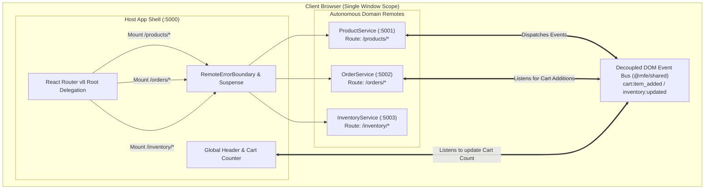

# Micro-Frontends (MFE) Getting Started Notebook

<div align="center">

### Interactive Architectural Guide & Hands-On E-Commerce Walkthrough
**Target Stack:** Vite 8 + Module Federation + React 19 + React Router v8 + Tailwind CSS v4 + pnpm Workspaces  
**Author:** Subrata Roy

</div>

---

## Table of Contents
1. [Introduction: Why Micro-Frontends?](#1-introduction-why-micro-frontends)
2. [The Architecture Map: Enterprise E-Commerce](#2-the-architecture-map-enterprise-e-commerce)
3. [Hands-On Step 1: Scaffolding the Remotes](#3-hands-on-step-1-scaffolding-the-remotes)
4. [Hands-On Step 2: Routing & Dynamic Federation](#4-hands-on-step-2-routing--dynamic-federation)
5. [Hands-On Step 3: Cross-Boundary Communication (Event Bus)](#5-hands-on-step-3-cross-boundary-communication-event-bus)
6. [Fault Tolerance & Error Isolation](#6-fault-tolerance--error-isolation)
7. [Developer Superpower: Targeted Local DX](#7-developer-superpower-targeted-local-dx)
8. [Production Deployment & Cache Strategy](#8-production-deployment--cache-strategy)

---

## 1. Introduction: Why Micro-Frontends?

As web applications scale across multiple engineering squads, traditional monolithic frontend architectures begin to degrade:
- **Deployment Bottlenecks**: A small bug in an analytics widget blocks an entire catalog or checkout release.
- **Dependency Drift & Version Lock**: Teams cannot update dependencies independently without risking regressions across unrelated features.
- **Monolithic CI/CD Friction**: Long build queues, slow test runs, and high developer friction.

### The Host Shell + Remotes Model

Our starter framework decomposes the frontend into:
1. **The Host Shell (`packages/host`)**: The primary shell container responsible for authentication state, top-level layout navigation, route delegation, and fault-tolerant `<RemoteErrorBoundary>` wrappers.
2. **Autonomous Remotes (`packages/*`)**: Independent micro-frontend applications that can be developed, tested, built, and deployed on their own lifecycle cadence without rebuilding the Host Shell.

---

## 2. The Architecture Map: Enterprise E-Commerce

To demonstrate real-world utility, this walkthrough constructs a multi-remote **E-Commerce Platform** comprised of three autonomous micro-frontends coordinated by a unified Host Shell:



### Domain Responsibilities

| Service | Port | Mount Path | Responsibilities |
| :--- | :---: | :---: | :--- |
| **Host Shell** | `5000` | `/` | Top-level header, cart counter widget, global navigation, and error isolation fallbacks. |
| **`ProductService`** | `5001` | `/products/*` | Product catalog grid, search/filtering, product detail views, and "Add to Cart" triggers. |
| **`OrderService`** | `5002` | `/orders/*` | Shopping cart drawer, checkout funnel, payment processing, and order history. |
| **`InventoryService`** | `5003` | `/inventory/*` | Stock availability indicators, warehouse inventory trackers, and low-stock alerts. |

---

## 3. Hands-On Step 1: Scaffolding the Remotes

In this framework, micro-frontends are registered via a **Single Source of Truth** manifest: `remotes.manifest.json`.

### 1.1 Register Remotes in `remotes.manifest.json`

Add the three domain services to `remotes.manifest.json`:

```json
{
  "productService": {
    "port": 5001,
    "path": "/products",
    "entry": "/assets/remoteEntry.js",
    "envVar": "VITE_PRODUCT_SERVICE_URL"
  },
  "orderService": {
    "port": 5002,
    "path": "/orders",
    "entry": "/assets/remoteEntry.js",
    "envVar": "VITE_ORDER_SERVICE_URL"
  },
  "inventoryService": {
    "port": 5003,
    "path": "/inventory",
    "entry": "/assets/remoteEntry.js",
    "envVar": "VITE_INVENTORY_SERVICE_URL"
  }
}
```

> [!NOTE]
> All build scripts, preview servers, and host federation configs read this manifest dynamically. Adding a remote here wires it into the monorepo orchestration automatically.

### 1.2 Configure Remote Federation Provider (`packages/productService/vite.config.js`)

Each remote exposes its root sub-app and individual components:

```javascript
import federation from "@originjs/vite-plugin-federation";
import react from "@vitejs/plugin-react";
import tailwindcss from "@tailwindcss/vite";
import { defineConfig } from "vite";

export default defineConfig(({ mode }) => ({
  plugins: [
    react(),
    tailwindcss(),
    federation({
      name: "productService",
      filename: "remoteEntry.js",
      exposes: {
        // Expose full sub-application
        "./App": "./src/App.jsx",
        // Expose reusable standalone widget
        "./ProductCard": "./src/components/ProductCard.jsx",
      },
      shared: {
        // Enforce singletons to prevent "Invalid Hook Call" exceptions
        react: { singleton: true, requiredVersion: "^19.0.0" },
        "react-dom": { singleton: true, requiredVersion: "^19.0.0" },
        "react-router": { singleton: true, requiredVersion: "^8.0.0" },
      },
    }),
  ],
  preview: {
    port: 5001,
    strictPort: true,
    headers: {
      "Access-Control-Allow-Origin": "*", // Mandatory for cross-origin host loading
    },
  },
  build: {
    target: "esnext",
    minify: mode === "production",
    cssCodeSplit: false,
  },
}));
```

---

## 4. Hands-On Step 2: Routing & Dynamic Federation

### 2.1 Dynamic Promise-Based Federation in Host (`packages/host/vite.config.js`)

Instead of hardcoding remote URLs, the Host dynamically maps manifest entries into promise-based resolvers. This allows production environments to inject `window.__MFE_RUNTIME_CONFIG__` at runtime without rebuilding the shell:

```javascript
import { readFileSync } from "node:fs";
import { fileURLToPath } from "node:url";
import federation from "@originjs/vite-plugin-federation";
import react from "@vitejs/plugin-react";
import { defineConfig } from "vite";
import tailwindcss from "@tailwindcss/vite";

const manifestPath = fileURLToPath(new URL("../../remotes.manifest.json", import.meta.url));
const remotesManifest = JSON.parse(readFileSync(manifestPath, "utf-8"));

// Dynamically construct remote definitions
const remotes = Object.fromEntries(
  Object.entries(remotesManifest).map(([name, cfg]) => {
    const fallbackUrl = process.env[cfg.envVar] || `http://localhost:${cfg.port}${cfg.entry}`;
    return [
      name,
      {
        external: `Promise.resolve((typeof window !== 'undefined' && window.__MFE_RUNTIME_CONFIG__ && window.__MFE_RUNTIME_CONFIG__['${name}']) || '${fallbackUrl}')`,
        externalType: "promise",
      },
    ];
  })
);

export default defineConfig(({ mode }) => ({
  plugins: [
    react(),
    tailwindcss(),
    federation({
      name: "host",
      remotes,
      shared: {
        react: { singleton: true, requiredVersion: "^19.0.0" },
        "react-dom": { singleton: true, requiredVersion: "^19.0.0" },
        "react-router": { singleton: true, requiredVersion: "^8.0.0" },
      },
    }),
  ],
  server: { port: 5000, strictPort: true },
}));
```

### 2.2 Host Shell Routing (`packages/host/src/App.jsx`)

The Host Router delegates nested path control to each remote using wildcard paths (`/*`):

```jsx
import React, { Suspense, lazy } from "react";
import { Routes, Route } from "react-router";
import RemoteErrorBoundary from "./components/RemoteErrorBoundary";
import LoadingFallback from "./components/LoadingFallback";

// Lazily pull remotes over the network
const ProductServiceApp = lazy(() => import("productService/App"));
const OrderServiceApp = lazy(() => import("orderService/App"));
const InventoryServiceApp = lazy(() => import("inventoryService/App"));
const LandingPage = lazy(() => import("./pages/LandingPage"));

export default function App() {
  return (
    <Routes>
      <Route
        path="/"
        element={
          <Suspense fallback={<LoadingFallback message="Loading Host Shell..." />}>
            <LandingPage />
          </Suspense>
        }
      />

      {/* Wildcard "/*" lets ProductService manage /products/ and /products/:id */}
      <Route
        path="/products/*"
        element={
          <RemoteErrorBoundary remoteName="Product Catalog">
            <Suspense fallback={<LoadingFallback message="Streaming Product Service..." />}>
              <ProductServiceApp />
            </Suspense>
          </RemoteErrorBoundary>
        }
      />

      <Route
        path="/orders/*"
        element={
          <RemoteErrorBoundary remoteName="Order & Checkout Service">
            <Suspense fallback={<LoadingFallback message="Loading Orders..." />}>
              <OrderServiceApp />
            </Suspense>
          </RemoteErrorBoundary>
        }
      />

      <Route
        path="/inventory/*"
        element={
          <RemoteErrorBoundary remoteName="Inventory Service">
            <Suspense fallback={<LoadingFallback message="Loading Inventory..." />}>
              <InventoryServiceApp />
            </Suspense>
          </RemoteErrorBoundary>
        }
      />
    </Routes>
  );
}
```

### 2.3 Autonomous Relative Routing Contract (`packages/productService/src/App.jsx`)

To ensure micro-apps can run both **standalone** (`http://localhost:5001/`) and **embedded** (`http://localhost:5000/products/`), remotes must use relative paths:

```jsx
import React from "react";
import { Routes, Route, Link } from "react-router";
import ProductCatalogPage from "./pages/ProductCatalogPage";
import ProductDetailPage from "./pages/ProductDetailPage";

export default function App() {
  return (
    <div className="mfe-remote-root mfe-product-service">
      <Routes>
        <Route path="/" element={<ProductCatalogPage />} />
        <Route path=":id" element={<ProductDetailPage />} />
      </Routes>
    </div>
  );
}
```

- In `ProductCatalogPage.jsx`: `<Link to="item-123">` navigates relatively to `/products/item-123` when embedded, and `/item-123` when standalone.
- In `ProductDetailPage.jsx`: `<Link to=".." relative="path">` navigates back to the root catalog without hardcoding parent URLs.

---

## 5. Hands-On Step 3: Cross-Boundary Communication (Event Bus)

Micro-frontends should never share global state stores (Redux, Zustand) across independent deployments. Doing so introduces tight coupling and memory leaks. Instead, communicate using standard browser `CustomEvents` with our lightweight, lifecycle-safe `@mfe/shared` library.

### 5.1 Emitter: Dispatching Events (`ProductCard.jsx`)

When a user clicks "Add to Cart" inside the `productService` remote:

```jsx
import React from "react";
import { sendMfeEvent } from "@mfe/shared";

export default function ProductCard({ product }) {
  const handleAddToCart = () => {
    sendMfeEvent("cart:item_added", {
      item: {
        id: product.id,
        name: product.name,
        price: product.price,
      },
      quantity: 1,
      sender: "ProductService",
    });
  };

  return (
    <div className="p-4 rounded-xl border border-slate-800 bg-slate-950 flex items-center justify-between">
      <div>
        <h4 className="font-bold text-white">{product.name}</h4>
        <span className="text-indigo-400 font-semibold">${product.price}</span>
      </div>
      <button
        onClick={handleAddToCart}
        className="px-3.5 py-2 rounded-lg bg-indigo-600 hover:bg-indigo-500 text-white font-semibold text-xs transition"
      >
        Add to Cart +
      </button>
    </div>
  );
}
```

### 5.2 Listener: Auto-Cleanup React Hook (`CartHeaderWidget.jsx`)

The Host Shell and `orderService` listen for cart updates using `useMfeEventListener`, which automatically subscribes on mount and unsubscribes on unmount:

```jsx
import React, { useState } from "react";
import { useMfeEventListener } from "@mfe/shared";

export function CartHeaderWidget() {
  const [cartItems, setCartItems] = useState([]);

  // Subscribes safely with automated window event listener cleanup
  useMfeEventListener("cart:item_added", (detail) => {
    console.log(`[Cart] Received item from ${detail.sender}:`, detail.item);
    setCartItems((prev) => [...prev, detail.item]);
  });

  return (
    <div className="flex items-center gap-2 px-3 py-1.5 rounded-xl bg-slate-900 border border-slate-700 text-xs text-white">
      <span> Cart Counter:</span>
      <span className="px-2 py-0.5 rounded-full bg-indigo-600 font-bold font-mono">
        {cartItems.length}
      </span>
    </div>
  );
}
```

---

## 6. Fault Tolerance & Error Isolation

In a micro-frontend architecture, network partitions or unhandled runtime exceptions inside a remote must **never take down the Host application shell**.

### The `<RemoteErrorBoundary>` Shield

Every remote is isolated inside a `<RemoteErrorBoundary>`. When a remote throws an unhandled error or fails to load its remote manifest:

```
+--------------------------------------------------------+
+  Failed to load Product Catalog                      +
+ [MFE Boundary Isolated]                                +
+                                                        +
+ ChunkLoadError: Failed to fetch remoteEntry.js         +
+                                                        +
+ [ Retry Component]                                   +
+ Ensure the remote dev server is running on port 5001.  +
+--------------------------------------------------------+
```

- **Blast Radius Isolated**: Only the remote viewport renders the fallback card.
- **Host Operability**: Global navigation, user authentication, and sister micro-frontends remain 100% active and responsive.
- **Recovery**: Users can click **"Retry Component"** to reload the remote module without a full page refresh.

---

## 7. Developer Superpower: Targeted Local DX

In large enterprise monorepos with 10+ micro-frontends, requiring developers to boot every service locally wastes memory and CPU.

Our starter provides **Targeted Execution**:

```bash
# Compile and boot ONLY the Host Shell and ProductService
pnpm dev:only productService
```

### What Happens:
1. `scripts/orchestrate.js` filters `remotes.manifest.json` down to `productService`.
2. It compiles only `packages/productService/` and starts its watch/preview server on port `5001`.
3. It launches the `packages/host/` Vite HMR development server on port `5000`.
4. Other remotes (`orderService`, `inventoryService`) are left offline; if navigated to, the Host's `<RemoteErrorBoundary>` gracefully indicates they are offline by design without crashing.

### Monorepo Command Quick Reference

| Command | Action |
| :--- | :--- |
| `pnpm dev` | Dynamically pre-builds all remotes, then concurrently starts watch, preview, and host dev. |
| `pnpm dev:only <name>` | Targeted DX: Boots only the Host Shell + the specified remote (e.g. `pnpm dev:only productService`). |
| `pnpm build` | Compiles all remotes topological in sequence, followed by the host shell. |
| `pnpm typecheck` | Validates ambient TypeScript contracts across module federation boundaries via `tsc --noEmit`. |
| `pnpm test` | Executes all 26 automated unit and integration tests via Vitest. |
| `pnpm lint` | Runs `oxlint` across all packages in the workspace. |

---

## 8. Production Deployment & Cache Strategy

When deploying micro-frontends to CDNs or edge platforms (Vercel, Netlify, Cloudflare, S3/CloudFront):

### Edge Cache Headers

1. **`remoteEntry.js` (Dynamic Index Manifest)**:
   ```http
   Cache-Control: no-cache, no-store, must-revalidate
   ```
   Ensures browsers immediately fetch the latest remote manifests upon deployment.

2. **Content-Hashed Chunks (`/assets/*.js`, `/assets/*.css`)**:
   ```http
   Cache-Control: public, max-age=31536000, immutable
   ```
   Safe to cache permanently across CDNs and browsers since filenames change on every build.

3. **CORS Headers**:
   ```http
   Access-Control-Allow-Origin: *
   ```
   Allows the Host domain (`app.example.com`) to asynchronously import chunks from remote CDNs (`products.cdn.example.com`).

---

<div align="center">

**Ready to start?** Clone the repository, run `pnpm install`, and boot `pnpm dev`!

[GitHub Repository](https://github.com/SubrataRoy100/monorepo-micro-frontend-setup) + [Version 1.0.0 Architecture Specification](v1.0.0_DOCUMENTATION.md)

</div>
