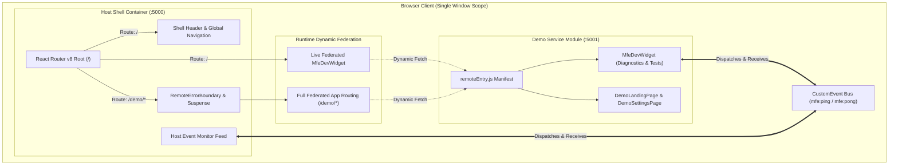
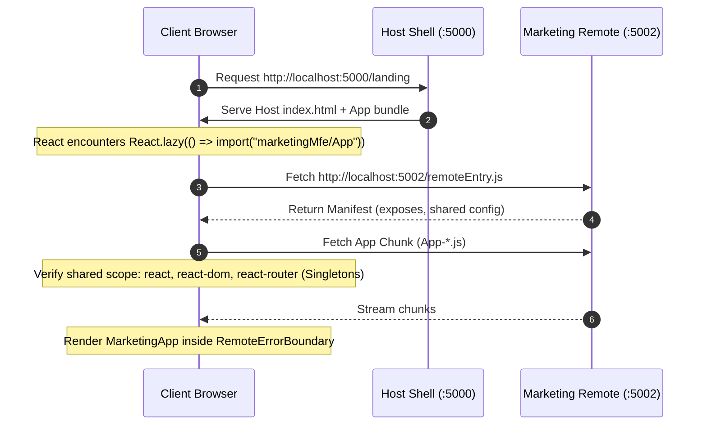
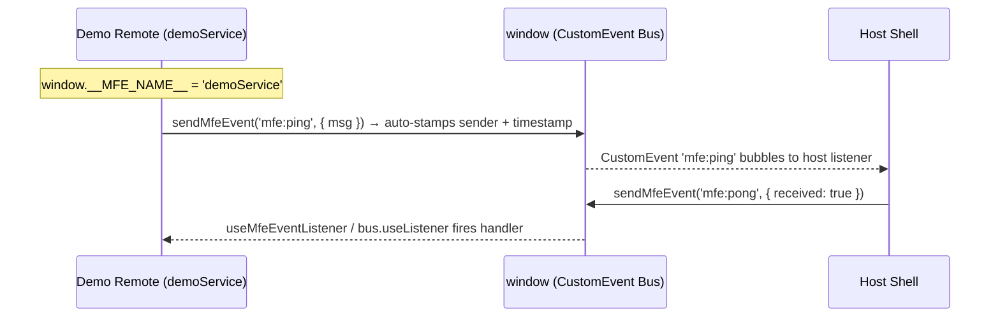

# Micro-Frontend Architecture Specification & Internal Documentation

<div align="center">

# Project Version: `1.0.0` &nbsp;|&nbsp; `@subrataroy100/mfe-shared` v1.0.2
### Production-Ready Micro-Frontend Monorepo Framework

**Author:** Subrata Roy  
**Core Technologies:** Vite 8, React 19, React Router v8, Tailwind CSS v4, pnpm Workspaces, Vite Module Federation

</div>

---

## 📑 Table of Contents
1. [Architectural Overview & System Topology](#1-architectural-overview--system-topology)
2. [Workspace & Monorepo Architecture](#2-workspace--monorepo-architecture)
3. [Module Federation Mechanics & Internals](#3-module-federation-mechanics--internals)
4. [Routing Architecture & Autonomous Remote Execution](#4-routing-architecture--autonomous-remote-execution)
5. [Resilience Engine & Error Boundary Isolation](#5-resilience-engine--error-boundary-isolation)
6. [Cross-MFE Communication Protocol (Event Bus)](#6-cross-mfe-communication-protocol-event-bus)
7. [Development Testing Feature Playground](#7-development-testing-feature-playground)
8. [Build Pipeline & Cold-Start Race Condition Resolution](#8-build-pipeline--cold-start-race-condition-resolution)
9. [Feature & Component Catalog](#9-feature--component-catalog)
10. [Styling Architecture & CSS Scoping](#10-styling-architecture--css-scoping)
11. [Developer Guide: Adding New Services](#11-developer-guide-adding-new-services)
12. [Production Deployment & Edge Caching](#12-production-deployment--edge-caching)
13. [Automated Testing & Verification Suite](#13-automated-testing--verification-suite)
14. [Starter Reset & Demo Lifecycle Engine](#14-starter-reset--demo-lifecycle-engine)

---

## 1. Architectural Overview & System Topology

Version 1.0.0 establishes a multi-tenant web application framework divided into an **Orchestration Shell (Host)** and **Decoupled Micro-Frontend Modules (Remotes)**. 

### High-Level Topology



### Core Design Objectives
1. **Zero Monolithic Cascade Failures**: If a remote fails over the network, only its designated viewport is replaced with a fallback card; the host navigation and other remotes continue functioning.
2. **Dual Execution Autonomy**: Every micro-app can be developed and run standalone on its own port without needing the host shell running.
3. **Decoupled Router Contracts**: Sub-apps rely strictly on relative routing so they can be mounted under any route prefix in the host without modifying code.
4. **Deterministic Shared Singletons**: React, ReactDOM, and React Router run as unified singletons to prevent state corruption and hook runtime exceptions.

---

## 2. Workspace & Monorepo Architecture

The monorepo is managed via **pnpm Workspaces** with strict supply-chain controls and unified lockfile resolution.

### Directory Structure & Responsibilities

```
mfe/
├── .github/workflows/ci.yml       # Automated CI pipeline (lint, build on matrix)
├── package.json                   # Root manifest (orchestration scripts & dev engines)
├── pnpm-workspace.yaml            # pnpm workspace definition
├── pnpm-lock.yaml                 # Sole authoritative lockfile for the entire monorepo
├── .gitignore                     # Git ignore rules (locks, dist, logs, modules)
├── README.MD                      # Project overview & developer quickstart
├── docs/                          # Comprehensive technical documentation
│   ├── How_I_setup.md             # Tutorial & setup evolution guide
│   └── v1.0.0_DOCUMENTATION.md    # Complete v1.0.0 internal architecture specification
└── packages/
    ├── shared/                    # Published & Internal Library (@subrataroy100/mfe-shared)
    │   ├── package.json           # Exports: ., ./events, ./events/core, ./adapters, ./vite, ./components/Button, ./constants
    │   ├── README.md              # Documentation for library
    │   └── src/
    │       ├── index.js           # Barrel export
    │       ├── events/            # Scoped Event Bus, Pure JS Core & Hooks
    │       ├── adapters/          # Universal Remote Mount & Dual-Mode Adapters
    │       ├── vite/              # Centralized Preset & CSS Auto-Injector
    │       └── constants/         # Shared ports & config (config.js)
    │
    ├── host/                      # Orchestration Shell (Port 5000)
    │   ├── package.json           # Depends on "@subrataroy100/mfe-shared": "workspace:*"
    │   ├── vite.config.js         # Federation consumer configuration & remotes map
    │   ├── index.html             # Host HTML entry template
    │   └── src/
    │       ├── main.jsx           # Host root mount & global window.__IS_HOST__ flag
    │       ├── App.jsx            # Host routes, lazy remote imports, and boundaries
    │       ├── index.css          # Host Tailwind v4 styles
    │       ├── components/        # Shell components
    │       │   ├── RemoteErrorBoundary.jsx  # Localized fault-isolation card
    │       │   └── LoadingFallback.jsx     # Animated skeleton streaming indicator
    │       └── pages/             # Host pages
    │           ├── LandingPage.jsx         # Hub portal, service catalog & dev test harness
    │           └── remotesRegistry.jsx     # Auto-generated zero-touch dynamic remote registry
    │
    ├── marketingMfe/              # Marketing Micro-Frontend Service (Port 5002, /landing)
    │   ├── package.json           # Depends on "@subrataroy100/mfe-shared": "workspace:*"
    │   ├── vite.config.js         # Federation producer config (App & MfeDevWidget exposed)
    │   ├── index.html             # Standalone development HTML entry
    │   └── src/
    │       ├── main.jsx           # Standalone entry point (<BrowserRouter><App /></BrowserRouter>)
    │       ├── App.jsx            # Remote routes
    │       ├── index.css          # Remote Tailwind v4 styles
    │       └── components/        # Feature components & MfeDevWidget
    │
    └── authMfe/                   # Authentication Micro-Frontend Service (Port 5003, /auth)
        ├── package.json           # Depends on "@subrataroy100/mfe-shared": "workspace:*"
        ├── vite.config.js         # Federation producer config
        ├── index.html             # Standalone development HTML entry
        └── src/
            ├── main.jsx           # Standalone entry point (<BrowserRouter><App /></BrowserRouter>)
            ├── App.jsx            # Remote routes
            └── index.css          # Remote Tailwind v4 styles
```

### Strict Single-Lockfile Policy
In v1.0.0, sub-package `pnpm-lock.yaml` files are prohibited. Running `pnpm install` at the root resolves all dependencies into a single root `pnpm-lock.yaml`. This ensures:
- Strict dependency version alignment across all packages.
- Zero duplicate copies of React or ReactDOM in the shared `node_modules` structure.
- Protection against phantom dependency drift.

---

## 3. Module Federation Mechanics & Internals

Module Federation is powered by `@module-federation/vite` (Module Federation 2.0) with backward compatibility for `@originjs/vite-plugin-federation`. It compiles modern ECMAScript Module (ESM) chunks and dynamic import manifests compatible with Vite 8 and Rolldown.

### The `remoteEntry.js` Manifest
When a remote like `marketingMfe` is built, the plugin generates `dist/remoteEntry.js`. This manifest serves as the remote's dynamic runtime index. It exposes:
1. **Module Registry**: A dictionary mapping public module specifiers (`./App`) to hashed build chunks.
2. **Shared Scope Resolution (`get` and `init`)**: Functions that negotiate shared libraries with the host at runtime.



### Shared Singletons Configuration
If two micro-frontends instantiate separate copies of `react` or `react-dom`, React hook states break with `"Invalid Hook Call"` errors. In v1.0.0, both packages enforce strict singletons:

```javascript
// packages/host/vite.config.js & packages/demoService/vite.config.js
shared: {
  react: { singleton: true },
  "react-dom": { singleton: true },
  "react-router": { singleton: true },
}
```

- When the host loads, it initializes the global `__federation_shared__` registry with its local React 19 instance.
- When `demoService` is dynamically fetched, it queries the shared registry. Since `singleton: true` is configured, it reuses the host's loaded React runtime rather than downloading or initializing a duplicate copy.

### Dynamic Runtime Remote Resolution (`externalType: "promise"`)
In enterprise CDNs and staging tiers, remotes frequently change IP addresses, ports, or CDN origins without warranting a rebuild of the host shell container. 

In `packages/host/vite.config.js`, all remotes are registered using dynamic promise resolution:
```javascript
remotes[name] = {
  external: `Promise.resolve(window.__MFE_RUNTIME_CONFIG__?.["${name}"] || "${defaultUrl}")`,
  externalType: "promise",
};
```
At runtime in the browser, the module federation loader executes this promise before initiating the network fetch:
1. It checks if `window.__MFE_RUNTIME_CONFIG__[name]` is defined (e.g. injected via Edge Worker, `<script>` tag, or runtime config endpoint).
2. If present, it loads the remote entry from the dynamically resolved URL.
3. If absent, it gracefully falls back to the build-time environment variable / localhost default.

---

## 4. Routing Architecture & Autonomous Remote Execution

A core architectural mistake in naive MFE setups is path-coupling. In v1.0.0, all routing follows the **Relative Routing Contract**.

### Host Wildcard Route
In `packages/host/src/App.jsx`:
```jsx
<Route
  path="/demo/*"
  element={
    <RemoteErrorBoundary remoteName="Demo Service Module">
      <React.Suspense fallback={<LoadingFallback message="Streaming Demo Service..." />}>
        <DemoApp />
      </React.Suspense>
    </RemoteErrorBoundary>
  }
/>
```
The trailing `/*` is critical: it tells React Router that `DemoApp` possesses internal child routes that the host router should delegate to the sub-app.

### Remote Sub-App Relative Routes
In `packages/demoService/src/App.jsx`:
```jsx
export default function App() {
  return (
    <Routes>
      <Route path="/" element={<LandingPage />} />
      <Route path="/settings" element={<DemoSettingsPage />} />
    </Routes>
  );
}
```

### Relative Navigation in Action
| View | Link Definition | Standalone Mode (`:5001`) | Host Embedded Mode (`:5000`) |
| :--- | :--- | :--- | :--- |
| **DemoLandingPage** | `<Link to="settings">` | `http://localhost:5001/settings` | `http://localhost:5000/demo/settings` |
| **DemoSettingsPage** | `<Link to=".." relative="path">` | `http://localhost:5001/` | `http://localhost:5000/demo` |

Because no absolute paths (`/demo/...`) are hardcoded inside `demoService`, it can be mounted under `/services/demo/*`, `/workspace/tools/*`, or root `/` with zero code modifications.

---

## 5. Resilience Engine & Error Boundary Isolation

Micro-frontends stream over the network at runtime. If a remote host goes down, encounters a 500 error, or throws an unhandled JS exception, the failure must be localized.

### `<RemoteErrorBoundary>`
Located at `packages/host/src/components/RemoteErrorBoundary.jsx`:
- Built on top of `react-error-boundary`.
- Intercepts uncaught JavaScript exceptions during both module streaming and React rendering.
- Displays an inline diagnostics card containing the error message, an **MFE Boundary Isolated** badge, and an interactive **Retry Component** button.
- Triggers `resetErrorBoundary()`, which re-attempts rendering without requiring a full browser reload.

### `<LoadingFallback>`
Located at `packages/host/src/components/LoadingFallback.jsx`:
- Replaces `fallback={null}` with an animated SVG/CSS skeleton.
- Informs the user that the micro-frontend chunk is actively streaming over the network, eliminating blank screen flashes.

---

## 6. Cross-MFE Communication Protocol (Event Bus)

Micro-frontends should remain loosely coupled. Sharing global state management libraries (such as Redux or Zustand) across remote bundle boundaries introduces bundle bloat and brittle version coupling.

`@subrataroy100/mfe-shared` v1.0.2 provides an asynchronous, browser-native event bus. The primary subpath is `@subrataroy100/mfe-shared/events`; a React-free alternative lives at `@subrataroy100/mfe-shared/events/core` for Vue, Svelte, or Vanilla-JS remotes.

### A. Built-in Event Constants (`MFE_EVENTS`)

All canonical system-level event names are exported as the `MFE_EVENTS` constant:

```typescript
import { MFE_EVENTS } from '@subrataroy100/mfe-shared/events';

// MFE_EVENTS shape:
{
  PING:        'mfe:ping',
  PONG:        'mfe:pong',
  NOTIFICATION:'mfe:notification',
  NAVIGATION:  'mfe:navigation',
  CART_UPDATE: 'mfe:cart_update',
  ORDER_PLACED:'mfe:order_placed',
}
```

### B. Global Broadcast Utilities (`sendMfeEvent` / `listenMfeEvent`)

For simple global fan-out events that do not require scoping, use the two standalone utilities:

```typescript
import { sendMfeEvent, listenMfeEvent, MFE_EVENTS } from '@subrataroy100/mfe-shared/events';

// Dispatches a CustomEvent on `window`.
// Auto-attaches `timestamp` and `sender` (read from window.__MFE_NAME__ or window.__IS_HOST__).
sendMfeEvent(MFE_EVENTS.PING, { message: 'hello from remote' });

// Returns an unsubscribe function — call it to remove the listener.
const unsubscribe = listenMfeEvent(MFE_EVENTS.PONG, (event) => {
  console.log('Received pong', event.detail);
});

// Later, on teardown:
unsubscribe();
```

**Sender identity**: Each remote sets `window.__MFE_NAME__` in its `main.jsx`. `sendMfeEvent` reads this value and stamps it onto every outgoing event's `detail.sender` field so consumers always know the origin of a message. The host shell sets `window.__IS_HOST__ = true` instead.

### C. React Hook (`useMfeEventListener`)

For React components that need a single-event subscription without a scoped bus, the standalone hook is the simplest API. It is stable against re-renders via an internal ref:

```tsx
import { useMfeEventListener, MFE_EVENTS } from '@subrataroy100/mfe-shared/events';

function PongDisplay() {
  const [lastPong, setLastPong] = useState<string | null>(null);

  // Automatically adds and removes the listener based on component lifecycle.
  useMfeEventListener(MFE_EVENTS.PONG, (event) => {
    setLastPong(event.detail.timestamp);
  });

  return <span>Last pong: {lastPong}</span>;
}
```

### D. Scoped Event Bus Factory (`createMfeEventBus`)

To eliminate event-name collisions across teams and remotes, each service creates a **scoped bus** instance. There are two variants:

| Import path | Returns | React `useListener` hook |
| :--- | :--- | :--- |
| `@subrataroy100/mfe-shared/events` | `ScopedEventBus` | ✅ Included |
| `@subrataroy100/mfe-shared/events/core` | `ScopedCoreEventBus` | ❌ Not included |

**`ScopedEventBus` interface (from `/events`):**

```typescript
interface ScopedEventBus {
  sender:    string;
  namespace: string | null;

  /** Prepends the namespace prefix to the raw event name. */
  resolveEventName(eventName: string): string;

  /** Dispatches the event via sendMfeEvent (adds timestamp + sender automatically). */
  send(eventName: string, payload?: unknown): void;

  /** Adds a window listener; returns an unsubscribe function. */
  listen(eventName: string, handler: (event: CustomEvent) => void): () => void;

  /** React hook — subscribes on mount, unsubscribes on unmount. Stable against re-renders. */
  useListener(eventName: string, handler: (event: CustomEvent) => void): void;
}
```

**Creating and using a scoped bus:**

```typescript
// checkout-remote: src/bus.ts
import { createMfeEventBus } from '@subrataroy100/mfe-shared/events';

export const checkoutBus = createMfeEventBus({
  sender:    'checkout-remote',
  namespace: 'checkout',
});

// Namespace resolution: 'item:added' → 'checkout:item:added'
checkoutBus.send('item:added', { itemId: 'sku-42', qty: 1 });
```

**Namespace resolution rule**: When a `namespace` is provided, `resolveEventName` prepends it with a colon separator. For example, with `namespace: 'checkout'`, the raw name `'item:added'` resolves to the dispatched event name `'checkout:item:added'`. When `namespace` is `null`, the raw name is used unchanged.

### E. React Hook Subscription on a Scoped Bus (`bus.useListener`)

Inside React components, `useListener` manages lifecycle subscriptions with guaranteed unmount cleanup and is stable against re-renders via an internal ref:

```tsx
import { checkoutBus } from '../bus';

function CartBadge() {
  const [count, setCount] = useState(0);

  checkoutBus.useListener('item:added', (event) => {
    setCount((c) => c + event.detail.qty);
  });

  return <span>Items: {count}</span>;
}
```

### F. Core (No-React) Bus for Non-React Remotes

For Vue, Svelte, or Vanilla-JS remotes that must not import React, use the `/events/core` subpath. It returns a `ScopedCoreEventBus` — identical to `ScopedEventBus` except the `useListener` hook is absent:

```javascript
// svelte-remote / vue-remote
import { createMfeEventBus } from '@subrataroy100/mfe-shared/events/core';

const bus = createMfeEventBus({ sender: 'vue-remote', namespace: 'catalog' });

const unsub = bus.listen('product:viewed', (e) => console.log(e.detail));
// Call unsub() in your framework's destroy / onUnmounted lifecycle hook.
```

### G. Strong Typing via Module Augmentation

Extend the `MfeEventRegistry` interface to gain full TypeScript autocompletion and payload validation for any event name — both global and namespaced:

```typescript
// types/mfe-events.d.ts (inside any workspace package)
declare module '@subrataroy100/mfe-shared' {
  interface MfeEventRegistry {
    'mfe:cart_update':    { itemCount: number; total: number };
    'checkout:item:added': { itemId: string; qty: number };
  }
}
```

Once declared, `sendMfeEvent`, `listenMfeEvent`, `bus.send`, and `bus.listen` all infer the correct payload type for the registered event name.

### H. Event Flow Diagram



---

## 7. Development Testing Feature Playground

To allow developers to verify their setup, v1.0.0 includes an interactive testing harness:

### 1. The `<MfeDevWidget />` Component
Exposed from `demoService` as `./MfeDevWidget` and consumed dynamically inside `packages/host/src/pages/LandingPage.jsx`.

### 2. Capabilities & Test Scenarios

```
+-------------------------------------------------------------------------+
| [🧪] Remote Widget Federated into Host Shell      [Embedded in Host Shell] |
| Federated component for testing runtime isolation & cross-app events.     |
+-------------------------------------------------------------------------+
|  ACTIVE ORIGIN: http://localhost:5000     |  PINGS DISPATCHED: 4        |
+-------------------------------------------------------------------------+
|  [📨 Send MFE Ping]    [💥 Simulate Crash (Test ErrorBoundary)]         |
+-------------------------------------------------------------------------+
```

1. **Context Awareness**:
   - Checks `window.__IS_HOST__`.
   - On `:5001` (Standalone), displays purple **"Standalone Mode (Port 5001)"** badge.
   - On `:5000` (Host), displays blue **"Embedded in Host Shell"** badge.
2. **Real-time Event Verification**:
   - Clicking **"Send MFE Ping"** emits `mfe:ping`.
   - The Host Landing Page captures the event, adds it to the live **Host Event Feed**, and dispatches `mfe:pong` back to the widget.
3. **Resilience Verification**:
   - Clicking **"Simulate Crash"** sets internal state to throw a fatal error.
   - `<RemoteErrorBoundary>` catches the exception and displays the error fallback.
   - The rest of the host shell (header, sub-services cards, navigation) remains unaffected.
   - Clicking **"Retry Component"** resets the boundary.

---

## 8. Build Pipeline & Cold-Start Race Condition Resolution

### The Cold-Start Race Problem
`@originjs/vite-plugin-federation` generates `remoteEntry.js` during Vite's build phase. When running in development:
- The remote runs `vite build --watch` and `vite preview --port 5001`.
- If a developer freshly clones the repository and runs `pnpm dev`, `dist/` does not exist yet.
- `vite preview` will fail or return 404s, and `host dev` will fail when requesting `http://localhost:5001/remoteEntry.js`.

### Manifest-Driven Orchestration (`remotes.manifest.json`)
Rather than hardcoding remote filters in root `package.json`, all remotes are registered centrally in `remotes.manifest.json` and orchestrated via `scripts/orchestrate.js`:

```json
"scripts": {
  "remotes:list": "node scripts/orchestrate.js list",
  "dev:remotes-build": "node scripts/orchestrate.js build-remotes",
  "dev:host": "pnpm --filter host dev",
  "dev": "node scripts/orchestrate.js dev",
  "build:remotes": "node scripts/orchestrate.js build-remotes",
  "build:host": "pnpm --filter host build",
  "build": "node scripts/orchestrate.js build"
}
```

1. **Synchronous Manifest Pre-Build**: `pnpm dev` executes `scripts/orchestrate.js dev`, which dynamically loads all remotes from `remotes.manifest.json` and executes `pnpm --filter <remote1> ... build` synchronously first.
2. **Deterministic Manifest Verification**: Within ~1 second, `dist/` is generated with valid `remoteEntry.js` manifests for all registered remotes.
3. **Concurrently Spawning**: Programmatic `concurrently` then safely launches watch and preview processes for each registered remote alongside the host development server with distinct prefixed logging colors.

### Vite 8 Minification & Template Literal Resolution (`federation-css-fix`)
In Vite 8, production builds enable esbuild minification. Under `target: "esnext"`, esbuild optimizes string literals into ES2022 template literals (backticks `` `...` ``).

Because `@originjs/vite-plugin-federation` v1.4.1 internally uses a strict regular expression `new RegExp('(["\'])' + DYNAMIC_LOADING_CSS_PREFIX + '.*?\\1', 'g')` that only matches single and double quotes (`"` or `'`), minified backtick template literals were bypassed. This resulted in the placeholder string literal being passed to `dynamicLoadingCss(cssFilePaths)`, triggering `TypeError: e.forEach is not a function`.

Every remote configures the post-build plugin `federation-css-fix`:
```javascript
{
  name: "federation-css-fix",
  enforce: "post",
  generateBundle(options, bundle) {
    const entryKey = Object.keys(bundle).find((key) => key.endsWith("remoteEntry.js"));
    if (!entryKey || !bundle[entryKey]?.code) return;

    const cssFiles = Object.keys(bundle)
      .filter((name) => name.endsWith(".css"))
      .map((name) => name.split("/").pop());

    // Replace all single-quote, double-quote, and backtick placeholders with the resolved CSS array
    bundle[entryKey].code = bundle[entryKey].code.replace(
      /(["'`])__v__css__.*?\1/g,
      JSON.stringify(cssFiles)
    );
  },
}
```

### Turborepo Production Build & Caching
For production deployment, running:
```bash
pnpm build
```
Executes `turbo run build`, orchestrating parallel builds across all workspace packages with output caching (`dist/**`). Unchanged packages replay instantly (`>>> FULL TURBO`), drastically reducing CI and local build times.


---

## 9. Feature & Component Catalog

### Host Package (`packages/host`)
| Component / Utility | File | Responsibility |
| :--- | :--- | :--- |
| **Host Entry** | `src/main.jsx` | Initializes React 19 root, sets `window.__IS_HOST__`, wraps `<BrowserRouter>`. |
| **Host Router** | `src/App.jsx` | Declares `/` (Hub) and `/demo/*` routes with lazy imports and boundaries. |
| **RemoteErrorBoundary**| `src/components/RemoteErrorBoundary.jsx` | Localized error boundary with retry capability. |
| **LoadingFallback** | `src/components/LoadingFallback.jsx` | Skeleton loading UI for remote chunk streaming. |
| **LandingPage** | `src/pages/LandingPage.jsx` | Hub portal, available service catalog, live dev test playground, and event feed. |
| **Event Bus Utility** | `src/utils/mfe-events.js` | CustomEvent dispatch and hook-based listener. |

### Demo Service Package (`packages/demoService`)
| Component / Utility | File | Responsibility |
| :--- | :--- | :--- |
| **Remote Entry** | `src/main.jsx` | Standalone development entry point. |
| **Remote Sub-App** | `src/App.jsx` | Exposes `./App`. Defines relative child routes `/` and `/settings`. |
| **MfeDevWidget** | `src/components/MfeDevWidget.jsx` | Exposes `./MfeDevWidget`. Context detection, ping/pong test, crash simulation. |
| **Button** | `src/components/Button.jsx` | Reusable styled UI button with `primary`, `secondary`, and `danger` variants. |
| **DemoLandingPage** | `src/pages/DemoLandingPage.jsx` | Operational dashboard view with metrics and embedded `<MfeDevWidget />`. |
| **DemoSettingsPage** | `src/pages/DemoSettingsPage.jsx` | Configuration form with relative navigation back to overview. |

---

## 10. Styling Architecture & CSS Scoping

Both packages use **Tailwind CSS v4** via the `@tailwindcss/vite` plugin.
- In `src/index.css`:
  ```css
  @import "tailwindcss";
  ```
- Tailwind v4 eliminates complex `tailwind.config.js` files by moving configuration directly into CSS `@theme` directives.
- In `vite.config.js`, `cssCodeSplit: false` is configured to ensure remote component styles are packaged with their respective entry points, avoiding unstyled flashes during dynamic chunk imports.

---

## 11. Developer Guide: Adding New Services

Follow this checklist to add a new micro-frontend service (e.g. `packages/billingService`):

### 1. Create Directory and Initialize
```bash
mkdir packages/billingService
cd packages/billingService
pnpm init
```

### 2. Configure `packages/billingService/package.json`
```json
{
  "name": "billingService",
  "private": true,
  "version": "1.0.0",
  "type": "module",
  "scripts": {
    "dev": "vite",
    "build": "vite build",
    "watch": "vite build --watch",
    "preview": "vite preview --port 5002 --strictPort",
    "lint": "oxlint"
  },
  "dependencies": {
    "@subrataroy100/mfe-shared": "workspace:*",
    "@tailwindcss/vite": "^4.3.3",
    "react": "^19.2.8",
    "react-dom": "^19.2.8",
    "react-router": "^8.4.0",
    "tailwindcss": "^4.3.3"
  },
  "devDependencies": {
    "@originjs/vite-plugin-federation": "^1.4.1",
    "@types/react": "^19.2.18",
    "@types/react-dom": "^19.2.7",
    "@vitejs/plugin-react": "^6.1.1",
    "oxlint": "^1.81.0",
    "vite": "^8.3.0"
  }
}
```

### 3. Configure `packages/billingService/vite.config.js`
Use the high-level preset from `@subrataroy100/mfe-shared/vite`. It automatically bundles React 19 singletons, Tailwind, the `federationCssFixPlugin`, and resolves ports from `remotes.manifest.json`:
```javascript
import { defineRemoteConfig } from "@subrataroy100/mfe-shared/vite";

export default defineRemoteConfig({
  name: "billingService",
  exposes: {
    "./App": "./src/App.jsx",
  },
});
```

*Note: For services requiring custom plugins, additional shared libraries, or custom Vite options, `defineRemoteConfig` accepts `plugins`, `shared`, `server`, `preview`, `build`, and an `extend: (config, env) => void` hook.*


### 4. Register in `remotes.manifest.json`
Add the new service configuration directly to the root manifest—**no manual changes needed in `host/vite.config.js` or root scripts**:
```json
{
  "demoService": { ... },
  "billingService": {
    "port": 5002,
    "path": "/billing",
    "entry": "/remoteEntry.js",
    "envVar": "VITE_BILLING_SERVICE_URL"
  }
}
```

### 5. Mount in Host `packages/host/src/App.jsx`
```jsx
const BillingApp = React.lazy(() => import("billingService/App"));

// Inside <Routes>:
<Route
  path="/billing/*"
  element={
    <RemoteErrorBoundary remoteName="Billing Service">
      <React.Suspense fallback={<LoadingFallback message="Streaming Billing Service..." />}>
        <BillingApp />
      </React.Suspense>
    </RemoteErrorBoundary>
  }
/>
```

---

## 12. Production Deployment & Edge Caching

In production, micro-frontends are typically hosted on distinct CDNs, S3 buckets, or edge networks:
- Host Container: `https://app.example.com`
- Demo Remote: `https://demo.cdn.example.com`
- Billing Remote: `https://billing.cdn.example.com`

### Cache Invalidation Architecture
Pre-configured [`vercel.json`](../vercel.json) and [`netlify.toml`](../netlify.toml) configurations enforce edge cache rules:
1. **Manifest Files (`remoteEntry.js`)**:
   - `Cache-Control: no-cache, no-store, must-revalidate`
   - Guarantees browser clients immediately fetch the newest chunk manifests without waiting for stale CDN TTLs.
2. **Content-Hashed Bundles (`/assets/*`)**:
   - `Cache-Control: public, max-age=31536000, immutable`
   - Content-addressed filenames can be permanently cached across browsers and CDNs with zero cache poisoning risk.

### CORS Requirements
Ensure all remote servers include:
```
Access-Control-Allow-Origin: *
```
Enabling the host shell to asynchronously fetch remote manifests across distinct domains without CORS rejection.

---

## 13. Automated Testing & Verification Suite

Version 1.0.0 is paired with an automated **Vitest** test suite and TypeScript verification pipeline verifying component rendering, lifecycle safety, manifest parsing, targeted orchestration, and error isolation:

| Command | Purpose |
| :--- | :--- |
| `pnpm test` | Executes all 26 unit and integration tests across all packages. |
| `pnpm test:watch` | Runs Vitest in interactive watch mode for rapid TDD. |
| `pnpm test:coverage` | Generates detailed statement, branch, and line coverage reports via `@vitest/coverage-v8`. |
| `pnpm typecheck` | Validates TypeScript ambient contracts (`remotes.d.ts`, `mfe-events.d.ts`) across package boundaries with `tsc --noEmit`. |
| `pnpm dev:only <name>` | Targeted DX: Compiles and boots only the Host container and the specified remote micro-frontend. |

```
Test Files  4 passed (4)
     Tests  26 passed (26)
```

---

## 14. Starter Reset & Demo Lifecycle Engine

To transform the repository from an exploratory showcase into an unencumbered enterprise foundation, an automated lifecycle engine is built directly into the monorepo root:

### Reset to Clean Starter (`pnpm reset:demo`)
Removes the `demoService` micro-frontend and resets the host application shell into a pristine starter:
```bash
pnpm reset:demo
```
- **Automated Backup**: Copies `packages/demoService/`, current host router components, and `remotes.manifest.json` into `.demo-backup/`.
- **Manifest Pruning**: Removes `demoService` from `remotes.manifest.json`.
- **Host Template Transition**: Replaces `host/src/App.jsx` and `host/src/pages/LandingPage.jsx` with clean starter templates (`scripts/clean-templates.js`) that have zero dependencies on `demoService`.
- **Zero Broken Links**: `pnpm build`, `pnpm lint`, and `pnpm test` pass with 0 errors immediately after reset.

### Restoring the Demo Showcase (`pnpm restore:demo`)
Restores the showcase environment at any point from the local backup:
```bash
pnpm restore:demo
```
Reconstitutes `packages/demoService/`, updates `remotes.manifest.json`, and re-attaches the full federated widget and route boundaries.


